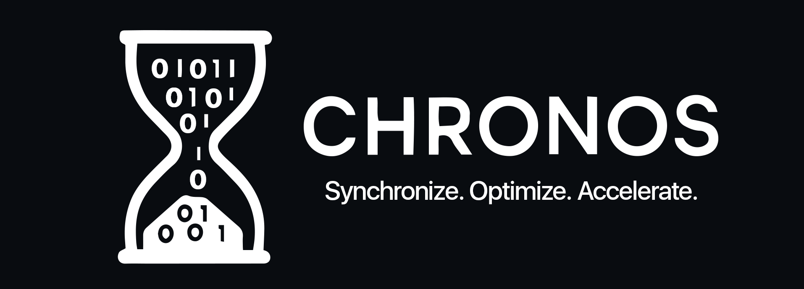

# CHRONOS | The CPU Scheduling Simulator
<div id="header" align="left">
 
</div>

A desktop application that simulates various CPU scheduling algorithms with a live Gantt chart visualization.

## Features

- Supports multiple CPU scheduling algorithms:
  - First-Come, First-Served (FCFS)
  - Shortest Job First (Preemptive and Non-Preemptive)
  - Priority Scheduling (Preemptive and Non-Preemptive)
  - Round Robin
- Live visualization of the scheduling process
- Dynamic process addition during simulation
- Real-time statistics (average waiting time, average turnaround time)
- Process status tracking
- Interactive Gantt chart

## Requirements

- Python 3.6+
- PyQt5 >= 5.15.0
- matplotlib >= 3.5.1
- pyinstaller >= 5.0.0 (for building executable)

## Installation

1. Clone this repository
2. Install the required packages:
```
pip install -r requirements.txt
```

## Usage

### Running the Application

To run the application in development mode:
```
python main.py
```

### Building an Executable

To build a standalone executable:
```
python build.py
```
The executable will be created in the `dist` folder.

## How to Use

1. **Select a scheduling algorithm** from the dropdown menu
2. **Add processes** by specifying:
   - Process name
   - Arrival time
   - Burst time
   - Priority (for Priority scheduling)
3. **Control the simulation**:
   - Start: Begin the simulation
   - Pause/Resume: Control the simulation flow
   - Stop: End the simulation
   - Run All At Once: Complete the simulation instantly
   - Speed: Adjust simulation speed


## Project Structure

- `main.py`: Application entry point
- `build.py`: Script for building the standalone executable
- `requirements.txt`: Python dependencies
- `example_processes.csv`: Sample process data for import
- `src/`
  - `models/`: Process data model
  - `core/`: Scheduler and simulation core logic
  - `algorithms/`: Implementation of different CPU scheduling algorithms
  - `gui/`: User interface components
    - `scenes/`: Different application screens
    - `resources/`: UI assets
- `assets/`: Application assets
- `docs/`: Documentation and resources

## Team Members

- [Shehab Mahmoud](https://github.com/ashmod)
- [Abdelrahman Hany](https://github.com/DopeBiscuit)
- [Youssef Shahean](https://github.com/unauthorised-401)
- [Seif Ahmed](https://github.com/seifelwarwary)
- [Seif Tamer](https://github.com/SeifT101)
- [Omar Mamon](https://github.com/Spafic)

## License

[MIT License](./LICENSE)
